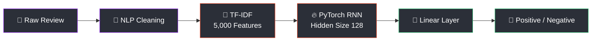
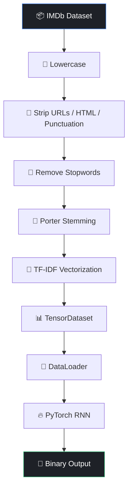

<div align="center">

# 🧠 RNN Sentiment Analysis

### Teaching a Recurrent Neural Network to *read between the lines* of a movie review

<br>


<br>

**`Raw Text`** → **`NLP Cleaning`** → **`TF-IDF Vector`** → **`PyTorch RNN`** → **`😊 / 😞`**

</div>

<br>

## 📖 Table of Contents

- [Overview](#-overview)
- [Architecture](#-architecture)
- [The Model](#-the-model)
- [Pipeline](#-pipeline)
- [Results](#-results)
- [Tech Stack](#️-tech-stack)
- [Project Structure](#️-project-structure)
- [Getting Started](#-getting-started)
- [What This Demonstrates](#-what-this-demonstrates)
- [Author](#-author)

<br>

## ⚡ Overview

> A **Recurrent Neural Network**, built from scratch in **PyTorch**, that reads an IMDb movie review and decides — *did the viewer love it, or hate it?*

This project walks through the **complete deep-learning workflow** for text classification, end to end:

```
  Preprocess  →  Vectorize  →  Tensorize  →  Build RNN  →  Train  →  Evaluate
```

No shortcuts, no black-box libraries doing the thinking — the RNN, the loss, the training loop, all handwritten and transparent.

<br>

## 🧩 Architecture



<br>

## 🧠 The Model

The heart of this project is a single `nn.RNN` layer doing the heavy lifting.

<div align="center">

| ⚙️ Parameter | 🔧 Value |
|:---|:---:|
| Architecture | `nn.RNN` |
| Hidden Size | `128` |
| Input Features | `5,000` |
| Loss Function | `BCELoss` |
| Optimizer | `Adam` |
| Epochs | `10` |
| Output | Binary Classification |
| **Test Accuracy** | **`85.16%`** |

</div>

<br>

## 🔄 Pipeline



<br>

## 📊 Results

<div align="center">

### 🎯 85.16% Test Accuracy

```
RNN  ████████████████████████████████████████████░░░░░  85.16%
```

*Trained for 10 epochs with Adam + BCELoss, evaluated on a held-out IMDb test split.*

</div>

<br>

## 🛠️ Tech Stack

<div align="center">

| Icon | Technology | Role |
|:---:|:---|:---|
| 🐍 | **Python** | Core programming language |
| 🔥 | **PyTorch** | RNN architecture & training |
| 🔤 | **NLTK** | NLP preprocessing & stemming |
| 📊 | **Scikit-learn** | TF-IDF vectorization & data splitting |
| 🐼 | **Pandas** | Data loading & handling |
| 📓 | **Jupyter / Colab** | Notebook development |

</div>

<br>

## 🗂️ Project Structure

```
RNN-for-Sentiment-Analysis/
│
├── 📓 imdb-sentiment-analysis-rnn.ipynb    # Full training & evaluation notebook
├── 📄 IMDB Dataset.csv                     # Raw movie review dataset
└── 📘 README.md                            # You are here
```

<br>

## 🚀 Getting Started

**1. Clone the repository**
```bash
git clone https://github.com/sumitjhadev/RNN-for-Sentiment-Analysis.git
cd RNN-for-Sentiment-Analysis
```

**2. Install dependencies**
```bash
pip install pandas nltk scikit-learn torch
```

**3. Launch the notebook**
```bash
jupyter notebook
```

Then open **`imdb-sentiment-analysis-rnn.ipynb`** and run the cells top to bottom. 🎬

<br>

## ✨ What This Demonstrates

- 🧠 Building a Recurrent Neural Network from scratch in PyTorch
- 🔢 Converting raw text into numerical features with TF-IDF
- 🧹 Practical, real-world NLP preprocessing
- ⚙️ Training with Adam optimizer + BCELoss
- 📦 Using PyTorch `TensorDataset` and `DataLoader`
- 📊 Evaluating a binary text classification model
- 🎯 Hitting **85.16%** test accuracy

<br>

<div align="center">

## 🏁 Final Takeaway

The dataset gives the task — but the **real story here is the RNN**: architecture, training loop, and evaluation, built and understood from the ground up.

<br>

### 🧠 BUILD · TRAIN · EVALUATE · LEARN

<br>

---

</div>

## 👤 Author

**Sumit Jha**
🔗 [@sumitjha.ai](https://github.com/sumitjhadev) &nbsp;•&nbsp; 💻 [github.com/sumitjhadev](https://github.com/sumitjhadev)

<div align="center">

⭐ **If this project helped you understand RNNs better, consider giving it a star!** ⭐

</div>
